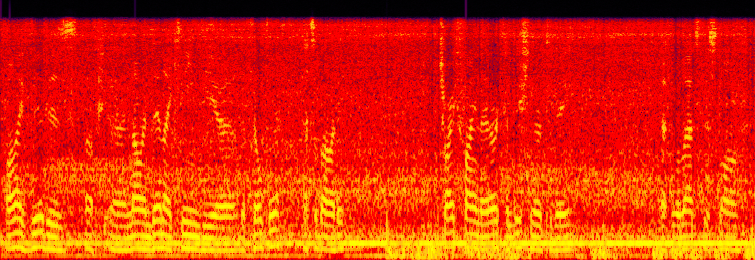
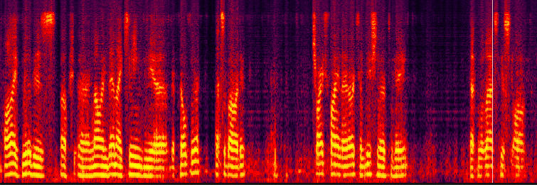

# Dual-signal Transformation LSTM Network

+ This repository provides the pytorch code example

+ official repo:  https://github.com/breizhn/DTLN
---


### 0. prequisites

- pytorch >= 1.11.0
- librosa

### 1. infer demo

```
python DTLN_model.py  --model_path ./pretrained/model.pth  \
   --wav_in ./samples/audioset_realrec_airconditioner_2TE3LoA2OUQ.wav \
   --wav_out ./out.wav
```

src wav：[./samples/audioset_realrec_airconditioner_2TE3LoA2OUQ.wav](./samples/)




after enhanced: [./samples/enahnced.wav](./samples/)




TODO:
- add realtime infer
- c++ deploy


### Citing

If you are using the DTLN model, please cite:

```BibTex
@inproceedings{Westhausen2020,
  author={Nils L. Westhausen and Bernd T. Meyer},
  title={{Dual-Signal Transformation LSTM Network for Real-Time Noise Suppression}},
  year=2020,
  booktitle={Proc. Interspeech 2020},
  pages={2477--2481},
  doi={10.21437/Interspeech.2020-2631},
  url={http://dx.doi.org/10.21437/Interspeech.2020-2631}
}
```
